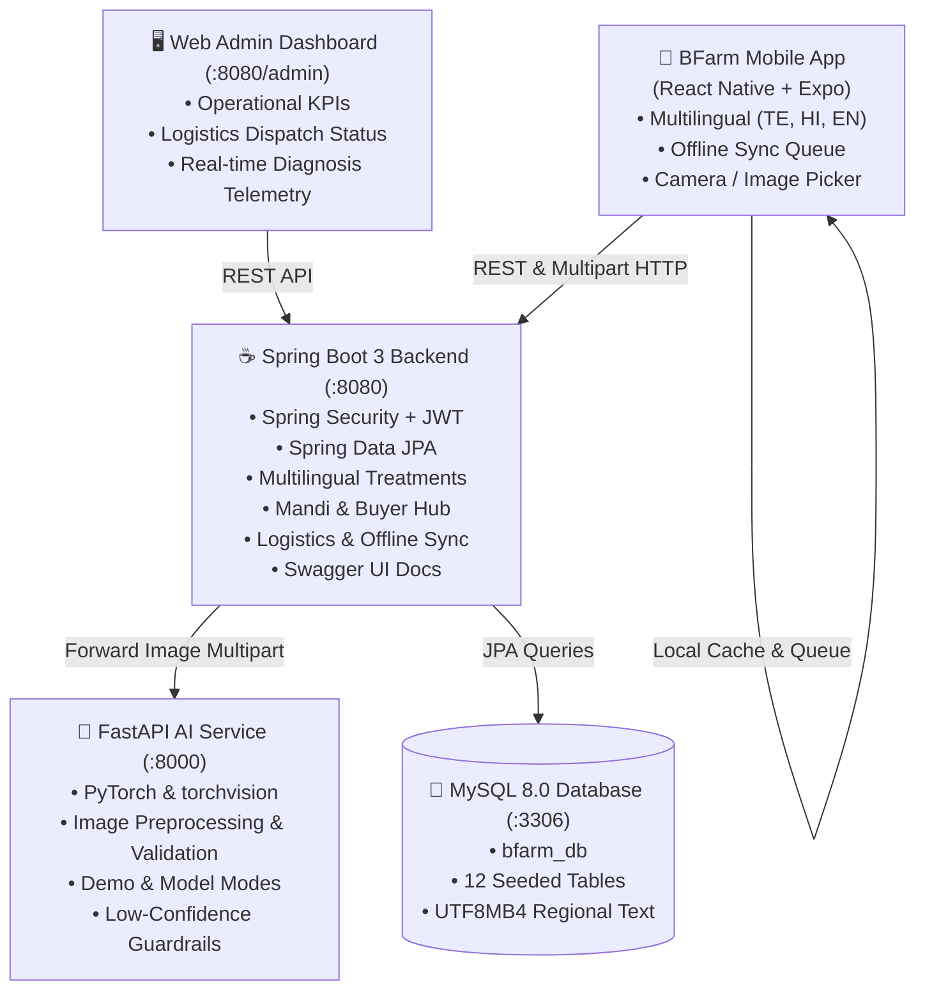
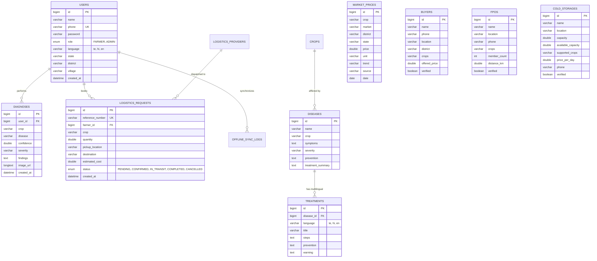

# BFarm — Smart Crop Care & Direct Market Access

> **"From Healthy Crops to Better Markets"**
>
> A complete, mobile-first agricultural ecosystem empowering small and marginal farmers across India. Inspired by the visual simplicity of Plantix, BFarm extends the core diagnosis journey into a full end-to-end post-harvest marketplace:
>
> **Photo → AI Diagnosis → Multilingual Treatment → Mandi Prices → Verified Buyers/FPOs → Cold Storage → Transport Logistics**

---

## Table of Contents
1. [Project Overview](#project-overview)
2. [Core Product Journey](#core-product-journey)
3. [System Architecture](#system-architecture)
4. [Database ER Diagram](#database-er-diagram)
5. [Technology Stack](#technology-stack)
6. [Prerequisites](#prerequisites)
7. [Quick Start Guide](#quick-start-guide)
8. [Running with Docker Compose](#running-with-docker-compose)
9. [Service Endpoints & Swagger UI](#service-endpoints--swagger-ui)
10. [Admin Command Center Dashboard](#admin-command-center-dashboard)
11. [Offline-First Architecture & Sync Queue](#offline-first-architecture--sync-queue)
12. [AI Microservice & PyTorch Model](#ai-microservice--pytorch-model)
13. [Multilingual Support (Telugu, Hindi, English)](#multilingual-support-telugu-hindi-english)
14. [Android APK Build Instructions](#android-apk-build-instructions)
15. [Demo Credentials](#demo-credentials)
16. [Testing & Verification](#testing--verification)

---

## Project Overview

Small and marginal farmers in India frequently face two major systemic challenges:
1. **Severe crop loss due to delayed plant pathology identification**: Fungal leaf blights, leaf curl viruses, and blasts often go undetected until significant crop yield is lost.
2. **Extreme market vulnerability and post-harvest price distress**: Farmers sell at low distress rates to local middlemen because they lack visibility into live mandi benchmarks, cold storage capacity, or rural transport options.

**BFarm** eliminates this fragmentation through a unified mobile solution designed for basic smartphones, low digital literacy, and intermittent 2G/3G connectivity.

---

## Core Product Journey

```
┌─────────────────┐
│   OPEN APP      │
└────────┬────────┘
         ▼
┌─────────────────┐
│ SELECT LANGUAGE │  (తెలుగు, हिंदी, English - remembered locally)
└────────┬────────┘
         ▼
┌─────────────────┐
│  HOME SCREEN    │  (Prominent "CHECK MY CROP" primary CTA)
└────────┬────────┘
         ▼
┌─────────────────┐
│  LEAF SCAN/CAM  │  (Natural lighting tips, focus guide, gallery upload)
└────────┬────────┘
         ▼
┌─────────────────┐
│  AI DIAGNOSIS   │  (PyTorch vision, confidence %, severity, lesion findings)
└────────┬────────┘
         ▼
┌─────────────────┐
│    TREATMENT    │  (Actionable steps, prevention, chemical safety, 🔊 Listen voice audio)
└────────┬────────┘
         ▼
┌─────────────────┐
│  MARKET PRICES  │  (Live APMC rates: Guntur, Vijayawada, Ongole, Kurnool, Hyderabad)
└────────┬────────┘
         ▼
┌─────────────────┐
│  SELLING MATRIX │  (Compare returns: Local Mandi vs Direct Processor vs Collective FPO)
└────────┬────────┘
         ▼
┌─────────────────┐
│  COLD STORAGE   │  (Facilities with MT capacity, daily rates, and phone links)
└────────┬────────┘
         ▼
┌─────────────────┐
│ RURAL LOGISTICS │  (Mini Truck, Pickup, Canter booking with reference AC-2026-00124)
└─────────────────┘
```

---

## System Architecture



---

## Database ER Diagram



---

## Technology Stack

| Layer | Technologies Used |
|---|---|
| **Mobile Frontend** | React Native, Expo 51, TypeScript, React Navigation (Tabs & Stack), `i18next` / `react-i18next`, `@react-native-async-storage/async-storage`, `expo-image-picker`, `expo-speech` (Voice TTS), `axios` |
| **Backend REST API** | Java 21, Spring Boot 3.3.4, Spring Data JPA, Spring Security, JWT (jjwt 0.12.5), Hibernate, SpringDoc OpenAPI 3 / Swagger UI, Lombok |
| **AI Microservice** | Python 3.12, FastAPI, PyTorch, torchvision, Pillow, Pydantic, Uvicorn, pytest |
| **Database** | MySQL 8.0 with `utf8mb4` encoding for regional Indian languages |
| **Admin Dashboard** | HTML5, Vanilla JavaScript, CSS3 responsive grid and glassmorphism |
| **Orchestration** | Docker, Docker Compose, Maven |

---

## Prerequisites

Ensure you have the following installed on your machine:
- **Node.js**: v18+ (verified on v22.x)
- **Java JDK**: 21+
- **Apache Maven**: 3.9+
- **Python**: 3.10+ (verified on 3.12.x)
- **MySQL Server**: 8.0 (or run via Docker)

---

## Quick Start Guide

### 1. Database Setup
Make sure MySQL is running on `localhost:3306`.
Create the database:
```sql
CREATE DATABASE IF NOT EXISTS bfarm_db CHARACTER SET utf8mb4 COLLATE utf8mb4_unicode_ci;
```

### 2. Start the AI Diagnosis Service
```bash
cd ai-service
pip install -r requirements.txt
python -m uvicorn app.main:app --host 0.0.0.0 --port 8000 --reload
```
*Health check:* `http://localhost:8000/health`  
*API documentation:* `http://localhost:8000/docs`

### 3. Start the Spring Boot Backend
```bash
cd backend
mvn clean spring-boot:run
```
*The database automatically creates all 12 tables and seeds rich agricultural demo data on first boot.*  
*Swagger REST API Documentation:* `http://localhost:8080/swagger-ui/index.html`  
*Admin Command Center:* `http://localhost:8080/admin/index.html`

### 4. Start the Mobile Frontend
```bash
cd mobile
npm install
npm run web
# OR for Android Emulator / Device:
npm run android
```

---

## Running with Docker Compose

To launch the complete stack with a single command:
```bash
docker-compose up --build
```
This starts:
- `bfarm-mysql` on port `3306`
- `bfarm-ai-service` on port `8000`
- `bfarm-backend` on port `8080`

---

## Service Endpoints & Swagger UI

Interactive OpenAPI docs are available at:  
👉 **`http://localhost:8080/swagger-ui/index.html`**

Key REST endpoints:
- `POST /api/auth/register` — Register new farmer
- `POST /api/auth/login` — Farmer & Admin login returning JWT
- `POST /api/diagnosis/analyze` — Multipart image diagnosis
- `GET /api/diagnosis/history/{userId}` — Diagnosis scan history
- `GET /api/treatments/{diseaseId}?lang=te` — Multilingual treatment remedies
- `GET /api/market/prices?crop=Tomato` — Mandi prices
- `GET /api/market/compare?crop=Tomato&quantityKg=500` — Opportunity comparison
- `GET /api/buyers?crop=Tomato` — Verified food buyers
- `GET /api/fpos?crop=Tomato` — Nearby FPOs
- `GET /api/storage?crop=Tomato` — Cold storage facilities
- `POST /api/logistics/request` — Book transportation
- `POST /api/sync/batch` — Batch sync offline requests
- `GET /api/admin/stats` — Admin KPI metrics

---

## Admin Command Center Dashboard

Access at:  
👉 **`http://localhost:8080/admin/index.html`**

Key features:
- **7 Live Operational KPIs**:
  - Total Farmers: `1,245`
  - Diagnoses Scanned: `3,821`
  - Top Scanned Crop: `Tomato`
  - Top Disease: `Early Blight`
  - Market Searches: `2,430`
  - Cold Storage Requests: `183`
  - Logistics Requests: `124`
- **Logistics Dispatch Board**: Instantly update booking status from `PENDING` → `CONFIRMED` → `IN_TRANSIT` → `COMPLETED`.
- **Live Diagnosis Feed**: View incoming crop scans with clinical lesion findings and confidence levels.
- **Mandi Price Manager & Buyers/FPO Registry**.

---

## Offline-First Architecture & Sync Queue

In rural areas, internet connectivity is frequently intermittent. BFarm implements a strict offline-first resilience protocol:

```
                  ┌───────────────────────┐
                  │ Farmer Creates Action │
                  │  (Logistics Request)  │
                  └──────────┬────────────┘
                             │
                  [ Check Network Status ]
                             │
             ┌───────────────┴───────────────┐
      Internet Available            Internet Unavailable
             │                               │
             ▼                               ▼
    POST /api/logistics/request      AsyncStorage Offline Queue
    (Immediate Server Ack)           - Generates AC-2026-XXXXX
                                     - Sets syncStatus = PENDING
                                     - Displays 🔴 Offline banner
                                             │
                                   [ Internet Restored ]
                                             │
                                             ▼
                                     Batch Auto-Sync
                                     POST /api/sync/batch
                                             │
                                             ▼
                                     ✓ "3 items synchronized"
```

---

## Multilingual Support

BFarm provides full UI and agricultural treatment localization in:
- **తెలుగు (Telugu)** — Default for Andhra Pradesh and Telangana agricultural belts
- **हिंदी (Hindi)** — Standard for Northern and Central India
- **English** — Universal fallback

Language preference is persisted locally in `AsyncStorage` and restored across application restarts.

---

## Android APK Build Instructions

To generate a production or standalone Android APK:

1. Install EAS CLI globally:
```bash
npm install -g eas-cli
```
2. Login to your Expo account:
```bash
eas login
```
3. Configure the build profile in `mobile/eas.json`:
```json
{
  "build": {
    "preview": {
      "android": {
        "buildType": "apk"
      }
    }
  }
}
```
4. Trigger the APK build:
```bash
cd mobile
eas build -p android --profile preview
```
5. Download the `.apk` file from the generated link and install directly onto any Android smartphone.

---

## Demo Credentials

| Role | Mobile Number | Password |
|---|---|---|
| **Demo Farmer** | `9876543210` | `farmer123` |
| **Demo Admin** | `9999999999` | `admin123` |

*Convenient 1-tap fill buttons for both accounts are provided directly on the mobile Login screen.*

---

## Testing & Verification

### Run Backend Tests (Spring Boot + JUnit + MockMvc)
```bash
cd backend
mvn clean test
```
*Executes 7 automated unit and integration tests covering authentication, market price lookups, selling option comparisons, and logistics booking creation.*

### Run AI Service Tests (pytest + FastAPI TestClient)
```bash
cd ai-service
pytest tests/
```
*Executes 6 automated tests verifying image security validation, format verification (JPEG/PNG), empty file rejection, and deterministic prediction output.*
